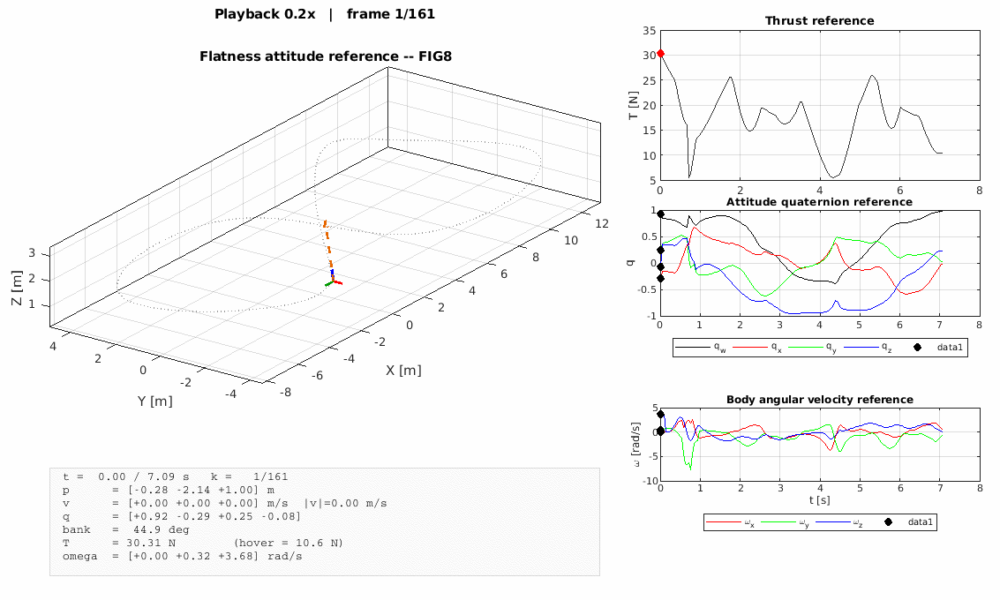

# Point-Mass Planning + NMPC Tracking for Time-Optimal Agile Quadrotor Gate Navigation

[](LICENSE)
[](https://www.python.org/)
[](https://docs.acados.org/)
[](https://web.casadi.org/)
[](https://mujoco.org/)
[](https://docs.ros.org/)

Companion code for the IEEE Access paper

> **Bryan S. Guevara, José Varela-Aldás**,
> *"Point-Mass Planning and NMPC Tracking for Time-Optimal Agile Quadrotor Gate Navigation"*,
> Centro de Investigación MIST, Facultad de Ingenierías,
> Universidad Tecnológica Indoamérica, Ambato, Ecuador, 2026.

This repository contains the **full pipeline** (planner → flatness bridge →
two NMPC formulations → MuJoCo evaluation) used in the paper, plus the LaTeX
source, the reference animations, and instructions to reproduce every figure
and table from scratch.

<p align="center">
  
  &nbsp;
  
</p>
<p align="center"><sub><b>Figure-8</b> (left) and <b>vertical loop</b> (right) differential-flatness references tracked by the NMPC.</sub></p>

---

## Table of contents

1. [What is in this repo](#1-what-is-in-this-repo)
2. [Pipeline overview](#2-pipeline-overview)
3. [Theory cheat-sheet](#3-theory-cheat-sheet)
4. [Repository layout](#4-repository-layout)
5. [Installation](#5-installation)
6. [Reproducing the paper](#6-reproducing-the-paper)
7. [Configuration knobs](#7-configuration-knobs)
8. [Citing](#8-citing)
9. [License & acknowledgements](#9-license--acknowledgements)

---

## 1. What is in this repo

| Contribution | File / folder |
|---|---|
| Time-optimal **Point-Mass Motion** (PMM) planner in 3-D with box-gate constraints | `path_planing/path_time_3D_PMM.py` |
| Gate circuits (figure-8 and vertical loop) | `path_planing/path_fig8.py`, `path_planing/path_loop.py` |
| Differential-**flatness bridge** (PMM → quadrotor state + body rates + thrust) | `path_planing/reference_conversion.py` |
| **NMPC-Att** (attitude-only reference, common baseline) and **NMPC-Full** (full flatness inversion) solvers, built on acados | `ocp/nmpc_gate_tracker.py` |
| Model-in-the-Loop evaluation (RK4 internal) | `experiments/mil_gate_experiment.py` |
| Software-in-the-Loop evaluation on **MuJoCo via ROS 2** | `experiments/sil_gate_experiment.py` |
| Statistical post-processing (mean ± IC95, Welch t-test) | `experiments/stats_summary.py` |
| Paper figures generator | `experiments/plot_gate_results.py` |
| Animated differential-flatness reference (MATLAB, exports GIF) | `path_planing/animate_flatness_ref.m` |
| IEEE Access LaTeX sources | `ACCESS_latex/access.tex` |

---

## 2. Pipeline overview

```
                ┌───────────────────────────────────────┐
                │  path_time_3D_PMM.py                  │
   gates, v_max │  Time-optimal point-mass planner      │
   a_max ─────▶│  (per-axis bang-bang; Pontryagin)     │
                └────────────────┬──────────────────────┘
                                 │  xref,uref,tref  (p*, v*, a*, j*)
                                 ▼
                ┌───────────────────────────────────────┐
                │  reference_conversion.py              │
                │  Differential-flatness bridge:        │
                │     a* + yaw  ->  q*, ω*, T*          │
                │     (Shepperd; causal FD + MA filter) │
                └────────────────┬──────────────────────┘
                                 │ 17-D param vector
                                 ▼
   ┌──────────────────────────┐        ┌──────────────────────────┐
   │   NMPC-Att  (baseline)   │        │   NMPC-Full (proposed)   │
   │ ref: p*, v*, q*_yaw      │        │ ref: p*, v*, q*, ω*, T*  │
   │ Qω = 0                   │        │ Qω = diag(0.5,0.5,0.5)   │
   │ acados SQP-RTI           │        │ acados SQP-RTI           │
   └────────────┬─────────────┘        └─────────────┬────────────┘
                │                                     │
                └───────────────┬─────────────────────┘
                                ▼
                ┌───────────────────────────────────────┐
                │  MiL  (experiments/mil_*)             │
                │  SiL on MuJoCo via ROS 2 (sil_*)      │
                │  → results/*.npy                      │
                └────────────────┬──────────────────────┘
                                 ▼
                ┌───────────────────────────────────────┐
                │  plot_gate_results.py                 │
                │  → ACCESS_latex/figs/*.pdf            │
                └───────────────────────────────────────┘
```

---

## 3. Theory cheat-sheet

### 3.1 Quadrotor body-rate model

State  **x = [p, v, q, ω] ∈ ℝ¹³**,  control **u = [T, ω_cmd] ∈ ℝ⁴**:

```
ṗ = v
v̇ = −g e₃ + (T / m) R(q) e₃
q̇ = ½ q ⊗ [0, ω]
ω̇ = (ω_cmd − ω) / τ_rc           (first-order inner-loop model, τ_rc = 0.03 s)
```

Parameters used in the paper: m = 1.08 kg, g = 9.81 m/s², T_max = 53 N
(≈ 5 g), |ω|∞ ≤ 10 rad/s.

### 3.2 Time-optimal PMM planner

Per-axis double integrator with bounded velocity and acceleration; the
time-optimal solution is **bang-bang in acceleration** (Pontryagin). Axes are
synchronised segment-by-segment so the trajectory passes through each gate
centre at the minimum-time instant:

```
min  T
s.t. p̈_i(t) ∈ {−a_max, 0, +a_max},   |ṗ_i(t)| ≤ v_max   (i = x,y,z)
     p(t_g) = p_gate,    t_0 = 0
```

Envelope used in the paper: **v_max = 14 m/s, a_max = 30 m/s²**; yields
T_opt ≈ 4.89 s (figure-8) and 4.44 s (loop).

> **Related work.** Full-dynamics time-optimal planners (e.g. Zhou *et al.*,
> *"Efficient and Robust Time-Optimal Trajectory Planning and Control for
> Agile Quadrotor Flight"*, IEEE RA-L, 2023 — [10.1109/LRA.2023.3322075](https://ieeexplore.ieee.org/document/10271530))
> solve the planning problem on the full 13-D quadrotor; our PMM formulation
> deliberately decouples planning (point-mass) from tracking (full-dynamics
> NMPC) to reach ms-scale planning times while preserving dynamic feasibility
> through the flatness bridge.

### 3.3 Differential-flatness bridge

Given a smooth reference (p*, v*, a*, ψ*) the quadrotor state is recovered
from the flat outputs:

```
z_b* = (a* + g e₃) / ‖a* + g e₃‖          (thrust direction)
T*   = m ‖a* + g e₃‖
x_c  = [cos ψ*, sin ψ*, 0]
y_b* = (z_b* × x_c) / ‖·‖,   x_b* = y_b* × z_b*
R*   = [x_b* y_b* z_b*]  →  q*  (Shepperd method)
ω*   ≈ unskew(Ṙ* R*ᵀ)                     (causal finite diff + 5-pt MA)
```

The bridge output is a 17-D parameter vector per MPC stage:
`[p*, v*, q*, ω*, T*, ω_cmd*]`.

### 3.4 NMPC formulation (both solvers)

```
min  Σ_{k=0}^{N−1} ‖p_k − p*_k‖²_Qp + ‖v_k − v*_k‖²_Qv
                 + ‖log(q*_k⁻¹ ⊗ q_k)‖²_Qq + ‖ω_k − ω*_k‖²_Qω
                 + ‖u_k − u*_k‖²_R
s.t.  x_{k+1} = f_d(x_k, u_k)                       (ERK4, 10 sub-steps)
      0 ≤ T ≤ T_max,   |ω_cmd|∞ ≤ ω_max,   x_0 = x̂
```

| Weight | Value |
|---|---|
| Qp | diag(35, 35, 40) |
| Qv | diag(6, 6, 6) |
| Qq | diag(15, 15, 15) |
| Qω | 0 (Att) / diag(0.5, 0.5, 0.5) (Full) |
| R | diag(0.3, 1, 1, 1) |

Horizon **N = 50**, T_h = 0.5 s, **100 Hz**; solved with acados
SQP-RTI + FULL_CONDENSING_HPIPM.

---

## 4. Repository layout

```
Time_optimal_planing+NMPC/
├── config/
│   └── experiment_config.py         # T_S, T_MAX, MASS, horizon, weights
├── path_planing/
│   ├── path_time_3D_PMM.py          # PMM planner
│   ├── path_fig8.py, path_loop.py   # Gate definitions
│   ├── reference_conversion.py      # Flatness bridge
│   ├── export_flatness_mat.py       # .mat exporter for MATLAB animation
│   ├── animate_flatness_ref.m       # MATLAB animation + GIF export
│   └── _preview_two_circuits.py     # 3-D preview (fig. 1 of the paper)
├── ocp/
│   └── nmpc_gate_tracker.py         # acados builders: Att and Full
├── experiments/
│   ├── mil_gate_experiment.py       # Model-in-the-Loop (internal RK4)
│   ├── sil_gate_experiment.py       # Software-in-the-Loop (MuJoCo + ROS 2)
│   ├── plot_gate_results.py         # Figure generator
│   ├── stats_summary.py             # Mean ± IC95 + Welch t-test
│   └── results/                     # *.npy outputs
├── ros2_interface/
│   ├── mujoco_interface.py          # Subscribes /quadrotor/odom, publishes /quadrotor/trpy_cmd
│   └── reset_sim.py                 # SimControl.reset() helper
├── c_generated_code_gate_att/       # acados-generated solver (Att)
├── c_generated_code_gate_full/      # acados-generated solver (Full)
├── ACCESS_latex/                    # Paper sources
│   ├── access.tex
│   ├── references.bib
│   └── figs/                        # Generated PDFs
└── README.md
```

---

## 5. Installation

Tested on **Ubuntu 22.04**, Python 3.10.

### 6.1 Python stack

```bash
python3 -m venv .venv && source .venv/bin/activate
pip install -U pip
pip install numpy scipy matplotlib casadi==3.7.2 mujoco
```

### 6.2 acados 0.5.3

```bash
git clone https://github.com/acados/acados.git
cd acados && git checkout v0.5.3
git submodule update --init --recursive
mkdir build && cd build
cmake -DACADOS_WITH_HPIPM=ON -DACADOS_WITH_QPOASES=ON ..
make -j$(nproc) && sudo make install
pip install -e ../interfaces/acados_template

# Add to ~/.bashrc
export ACADOS_SOURCE_DIR="$HOME/acados"
export LD_LIBRARY_PATH="$LD_LIBRARY_PATH:$ACADOS_SOURCE_DIR/lib"
```

### 6.3 ROS 2 Humble + MuJoCo bridge (only for SiL)

```bash
sudo apt install ros-humble-desktop
# plus the mujoco_quadrotor_sim package used in the paper (TRPY command + odom)
source /opt/ros/humble/setup.bash
source ~/uav_ws/install/setup.bash
```

If you do not have the ROS 2 stack you can still reproduce every plot in the
paper via the **Model-in-the-Loop** path (`experiments/mil_gate_experiment.py`),
which uses an internal RK4 integrator.

---

## 6. Reproducing the paper

### 7.1 Plan the two circuits

```bash
cd path_planing
python3 path_time_3D_PMM.py             # figure-8 (default CIRCUIT=fig8)
CIRCUIT=loop python3 path_time_3D_PMM.py
python3 _preview_two_circuits.py        # Fig. 1 of the paper
```

### 7.2 Build the two NMPC solvers (first time only)

The acados codegen is triggered automatically; force a rebuild after changing
`T_MAX` / weights:

```bash
rm -rf c_generated_code_gate_att c_generated_code_gate_full \
       acados_ocp_Drone_gate_att.json acados_ocp_Drone_gate_full.json
python3 -c "from ocp.nmpc_gate_tracker import build_gate_solver_att, build_gate_solver_full; \
            build_gate_solver_att(rebuild=True); build_gate_solver_full(rebuild=True)"
```

### 7.3 Model-in-the-Loop (no ROS needed)

```bash
CIRCUIT=fig8 N_TRIALS=10 python3 experiments/mil_gate_experiment.py
CIRCUIT=loop N_TRIALS=10 python3 experiments/mil_gate_experiment.py
```

### 7.4 Software-in-the-Loop (MuJoCo via ROS 2)

```bash
# Terminal 1
ros2 launch mujoco_quadrotor_sim quadrotor.launch.py

# Terminal 2
CIRCUIT=fig8 N_TRIALS=50 python3 experiments/sil_gate_experiment.py
CIRCUIT=loop N_TRIALS=50 python3 experiments/sil_gate_experiment.py
```

### 7.5 Figures and tables

```bash
python3 experiments/plot_gate_results.py
python3 experiments/stats_summary.py        # Tabla IV del paper
cd ACCESS_latex
pdflatex access && bibtex access && pdflatex access && pdflatex access
```

---

## 7. Configuration knobs

All global parameters live in **`config/experiment_config.py`**:

| Symbol | Variable | Default | Meaning |
|---|---|---|---|
| T_s | `T_S` | 0.01 s | Sampling period (100 Hz) |
| T_max | `T_MAX` | 53.0 N | Collective thrust bound (≈ 5 g for m = 1.08 kg) |
| ω_max | `W_MAX_GATE` | 10 rad/s | Body-rate bound |
| N | `N_HORIZON` | 50 | MPC horizon |
| T_h | `T_HORIZON` | 0.5 s | Prediction time |
| m | `MASS` | 1.08 kg | Vehicle mass |
| τ_rc | `TAU_RC` | 0.03 s | Inner-loop time constant |

PMM envelope is set at the top of `path_planing/path_time_3D_PMM.py`
(`V_MAX = 14.0`, `A_MAX = 30.0`).

---

## 8. Citing

```bibtex
@article{guevara2026pmmnmpc,
  author  = {Guevara, Bryan S. and Varela-Ald{\'a}s, Jos{\'e}},
  title   = {Point-Mass Planning and {NMPC} Tracking for Time-Optimal Agile
             Quadrotor Gate Navigation},
  journal = {IEEE Access},
  year    = {2026}
}

@article{zhou2023timeoptimal,
  author  = {Zhou, Ziyu and Wang, Gang and Sun, Jian and Wang, Jikai and Chen, Jie},
  title   = {Efficient and Robust Time-Optimal Trajectory Planning and Control
             for Agile Quadrotor Flight},
  journal = {IEEE Robotics and Automation Letters},
  year    = {2023},
  doi     = {10.1109/LRA.2023.3322075}
}
```

---

## 9. License & acknowledgements

Code released under the **MIT License**. The paper figures and LaTeX sources
in `ACCESS_latex/` follow the IEEE Access copyright policy.

This work builds on the open-source efforts of the acados, CasADi and MuJoCo
communities, to whom we are indebted.

- acados — https://docs.acados.org/
- CasADi — https://web.casadi.org/
- MuJoCo — https://mujoco.org/
- HPIPM  — https://github.com/giaf/hpipm

Contact: `bryansgue@gmail.com` · Corresponding author: José Varela-Aldás
(`josevarela@uti.edu.ec`) · Centro de Investigación MIST, Universidad
Tecnológica Indoamérica, Ambato, Ecuador.
# Time_optimal_planing-NMPC
